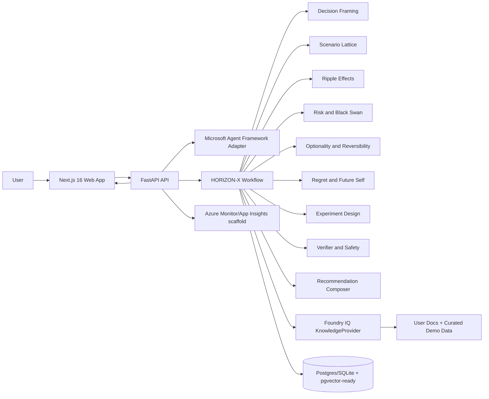
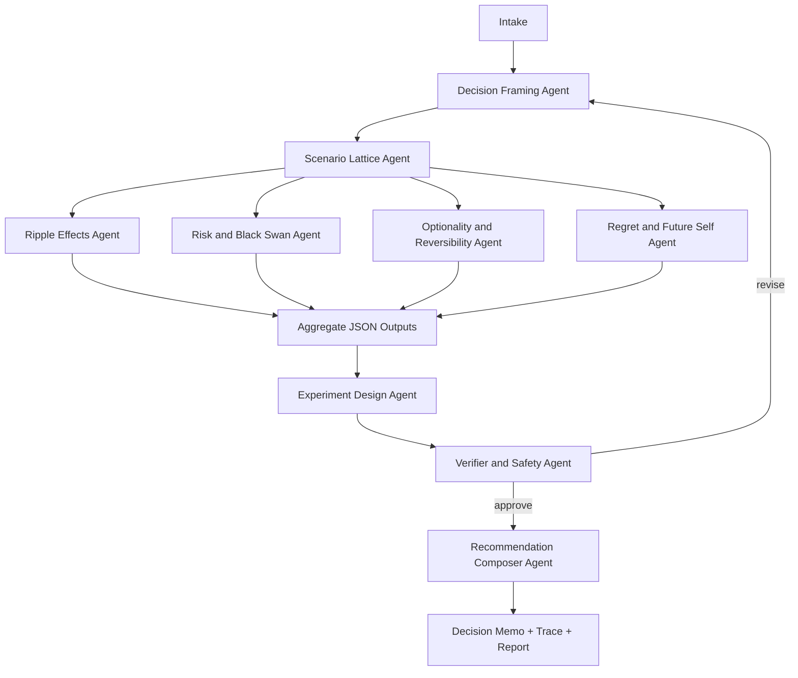
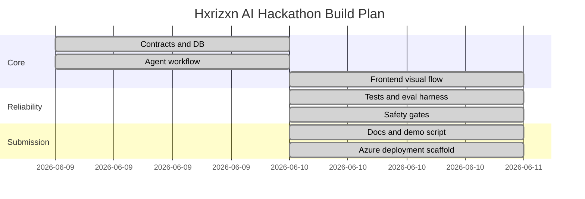

# Hxrizxn AI

Pronounced Horizon AI. Tagline: **See beyond the obvious future.**

Hxrizxn AI is a HORIZON-X multi-agent reasoning simulator for life-changing decisions. It is not a generic advice chatbot, therapist, lawyer, immigration advisor, or financial advisor. It frames a major decision, renders plausible futures, maps second-order consequences, scores reversibility and regret, and recommends a safer experiment before full commitment.

## Executive Summary

This repo implements a runnable MVP and production-ready skeleton for the Microsoft Agents League Reasoning Agents track. It includes a FastAPI backend, Microsoft Agent Framework-ready workflow adapter, Foundry IQ retrieval abstraction with mock fallback, persisted agent traces, typed JSON contracts, deterministic demo mode, a polished Next.js app, ECharts and React Flow visualizations, pytest/Vitest/Playwright tests, eval harness, Docker, GitHub Actions, Azure Bicep, sample data, and submission docs.

Official contest alignment is based on the public rules requiring a working project, public GitHub repo, max five-minute demo video, architecture diagram, and judging across accuracy, reasoning, creativity, UX, reliability/safety, and community vote.

## Assumptions

- Cloud credentials may be absent during judging, so `DEMO_MODE=true` runs fully with mock retrieval.
- `agent-framework==1.8.1` is pinned and included; local deterministic orchestration keeps demos repeatable while preserving the Microsoft Agent Framework integration seam.
- Foundry IQ is the primary grounding path when `FOUNDRY_IQ_*` env vars are configured; otherwise `MockKnowledgeProvider` serves curated `/demo-data`.
- The MVP supports demo/no-auth mode and keeps auth/OAuth/Microsoft Entra as a clean future extension.

## Repo Tree

```text
apps/
  api/                 FastAPI, agents, DB, tests, Alembic
  web/                 Next.js 16 app, visualizations, e2e
packages/
  agent-prompts/       Versioned HORIZON-X prompt library
  shared/              Shared product constants
  types/               Shared TS types and exported JSON schemas
  ui/                  Small reusable UI primitives
infra/bicep/           Azure Container Apps, Postgres, Storage, Key Vault, Monitor
demo-data/             Synthetic grounding docs and sample budget
evals/                 Golden decision cases and eval outputs
docs/                  Architecture, API, safety, deployment, demo, eval docs
scripts/               Seed, schema export, eval runner
```

## Architecture Description

The frontend sends a decision case to FastAPI. The backend stores it, runs HORIZON-X agents through strict Pydantic contracts, retrieves evidence through Foundry IQ or mock documents, persists scenarios/risks/experiments/traces, then returns a UI-ready package. The workflow exposes agent trace transparency without exposing chain-of-thought.



## Workflow



## Gantt Timeline



## HORIZON-X

- H: Hear the decision context
- O: Organize goals, constraints, and time horizon
- R: Render plausible futures
- I: Identify ripple effects and second-order consequences
- Z: Zoom into black swans and failure modes
- O: Optimize for reversibility and optionality
- N: Next-step safe experiments
- X: Explain recommendation, uncertainty, and evidence

## Screens and Mockups

- [Landing mockup](apps/web/public/mockups/landing.svg)
- [Intake mockup](apps/web/public/mockups/intake.svg)
- [Loading and trace mockup](apps/web/public/mockups/loading-trace.svg)
- [Comparison mockup](apps/web/public/mockups/comparison.svg)
- [Experiment mockup](apps/web/public/mockups/experiment.svg)
- [Final memo mockup](apps/web/public/mockups/final-memo.svg)

## Setup Commands

```powershell
python -m venv .venv
. .\.venv\Scripts\Activate.ps1
python -m pip install --upgrade pip
python -m pip install -e apps/api[dev]
npm install
Copy-Item .env.example .env
```

## Local Run

```powershell
# DB migrate
Set-Location apps/api
alembic upgrade head
Set-Location ../..

# Seed demo data
python scripts/seed_demo_data.py

# Backend
python -m uvicorn app.main:app --app-dir apps/api --reload --port 8000

# Frontend, in a second terminal
npm --workspace apps/web run dev
```

Open `http://localhost:3000`. API health is `http://localhost:8000/api/health`.

Full local stack:

```powershell
docker compose up --build
```

## Test and Eval Commands

```powershell
pytest apps/api/tests
npm --workspace apps/web run test
npm --workspace apps/web run test:e2e
python scripts/export_schemas.py
python scripts/run_evals.py
```

## Docker Commands

```powershell
docker build -t hxrizxn-api:local apps/api
docker build -t hxrizxn-web:local apps/web
docker compose up --build
```

## Azure Deployment

```powershell
az login
.\scripts\deploy_azure_recommended.ps1 `
  -SubscriptionId "<subscription-id>" `
  -Location "eastus" `
  -ResourceGroup "rg-hxrizxn-demo"
```

The script creates or reuses an ACR, builds API and web images in ACR, deploys Azure Container Apps, PostgreSQL, Blob Storage, Key Vault, and Monitor resources, then prints the API and web URLs. Foundry IQ and Azure OpenAI parameters are optional; leave them blank for deterministic demo mode.

## Demo Script

Use the canonical prompt from `/demo-data`: a software engineer with 3 years of experience, 8 months savings, and a decision to quit now, wait 6 months, or test an AI startup part-time. See [docs/demo.md](docs/demo.md) for the 5-minute talk track.

## Risk List and Mitigations

- False precision: use probability bands and uncertainty notes.
- Unsafe high-stakes advice: detect medical, legal, immigration, mental health, and large financial domains, then add boundaries.
- Hallucinated grounding: citations come from Foundry IQ when configured, otherwise curated mock docs.
- Demo brittleness: deterministic mock mode works without cloud credentials.
- Prompt injection from docs: retrieved text sanitizer removes instruction-like strings and redacts sensitive text.
- Privacy risk: demo data is synthetic and public-repo friendly.

## File-by-File Implementation

See [docs/file-by-file.md](docs/file-by-file.md).

## References

- Contest rules: https://github.com/microsoft/Agents-League-AISF-Regulations/blob/main/OFFICIAL%20RULES.md
- Microsoft Agent Framework overview: https://learn.microsoft.com/en-us/agent-framework/overview/
- Microsoft Agent Framework package: https://pypi.org/project/agent-framework/
