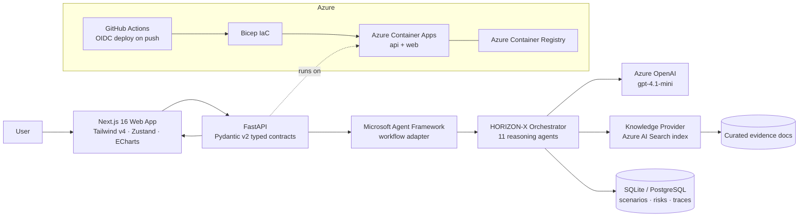
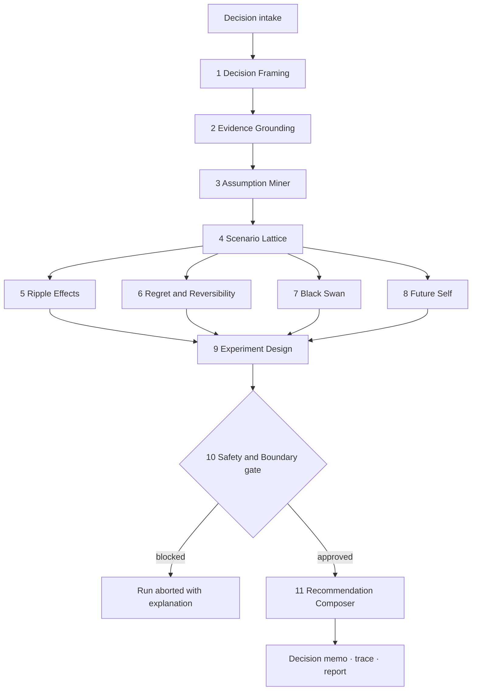

<p align="center">
  
</p>

<h1 align="center">Hxrizxn AI</h1>

<p align="center"><em>Pronounced "Horizon". See beyond the obvious future.</em></p>

<p align="center">
  <a href="https://github.com/microsoft/agentsleague"></a>
  
  
  
  
  
</p>

> Most AI tools give you an answer.
> Hxrizxn gives you your **futures**: rendered, stress-tested, scored for regret, and argued over by eleven specialist reasoning agents before anyone dares to recommend anything.

It is a **multi-agent decision simulator** for life-changing choices: quitting a job, buying a house, moving countries, going back to school. It does not tell you what to do. It shows you what each path *becomes*, two and three consequences deep, then designs a cheap, reversible experiment so you can test the future before you buy it.

---

## 🎬 Demo

> 📹 **Demo video:** _[▶ Watch on YouTube](#)_ &nbsp;`<- final link lands here before submission`
>
> 🌐 **Try it live, right now:** **https://hxrizxn-web.agreeableforest-fd08d701.eastus2.azurecontainerapps.io**
>
> 🩺 API heartbeat: [`/api/health`](https://hxrizxn-api.agreeableforest-fd08d701.eastus2.azurecontainerapps.io/api/health)

---

## 🎮 Don't read about it. Run it. Right here, in this README.

Below is the canonical demo case, fed to the live pipeline. Eleven agents have already argued about it.
**Your move: open the futures one by one.** (Condensed from a real Hxrizxn run.)

> 🧑‍💻 *"I'm a software engineer with 3 years of experience and 8 months of savings. Do I quit my job to build an AI startup, wait 6 months, or test it part-time first?"*

<details>
<summary>🌅 <strong>FUTURE 1 of 3: Controlled Upside Branch</strong> · probability band ~20–30%</summary>

<br/>

You quit with a plan, not a prayer. First customers arrive in month 4. Savings dip to 2.5 months before revenue stabilizes.

| Scorecard | Rating |
|---|---|
| Financial trajectory | 📈 Volatile, recovering by month 9 |
| Reversibility | 🟡 Medium: re-entering employment costs ~3 months |
| Identity alignment | 🟢 High: matches stated founder ambition |
| Hidden tax | Health insurance gap, months 1–6 |

</details>

<details>
<summary>⚖️ <strong>FUTURE 2 of 3: Evidence-Building Base Case</strong> · probability band ~45–60%</summary>

<br/>

You keep the job and build nights and weekends. Progress is slower but every assumption gets tested with someone else paying your rent.

| Scorecard | Rating |
|---|---|
| Financial trajectory | 🟢 Stable, savings grow to 11 months |
| Reversibility | 🟢 High: nothing burned, all doors open |
| Identity alignment | 🟡 Medium: "founder someday" itch persists |
| Hidden tax | Energy debt: ~20 evening hours/week for 6 months |

</details>

<details>
<summary>🌪️ <strong>FUTURE 3 of 3: Runway Compression Stress Case</strong> · probability band ~20–30%</summary>

<br/>

You quit, the first idea misses, a hiring downturn stretches re-entry to 5 months. Savings hit zero in month 7. The decision was survivable; the *timing* wasn't.

| Scorecard | Rating |
|---|---|
| Financial trajectory | 🔴 Runway exhausted before signal |
| Reversibility | 🔴 Low at month 6+: forced choices, weak leverage |
| Identity alignment | 🟡 Bruised but intact |
| Hidden tax | Compounding stress on health + relationships |

</details>

<details>
<summary>🕸️ <strong>What ripples outward</strong> · second and third-order effects</summary>

<br/>

- **Career:** 1st order: title gap → 2nd order: negotiating position weakens → 3rd order: next salary anchors lower.
- **Relationships:** founder hours strain partner time budget *before* money strain shows up. Hxrizxn flags this in month 2, not month 8.
- **Health:** sleep debt is the only ripple that touches all six tracked life domains.

</details>

<details>
<summary>🦢 <strong>The black swan nobody priced in</strong></summary>

<br/>

A foundation-model release makes the startup's core feature a commodity. Probability: low. Impact: total.
**Detectability:** high, *if* you're watching model release cadence weekly. The risk register includes the tripwire.

</details>

<details>
<summary>🧪 <strong>The 30-day experiment that beats deciding today</strong></summary>

<br/>

Don't choose a future. **Rent one.**

1. Weeks 1–2: ship a landing page + waitlist for the startup idea while employed.
2. Weeks 2–4: 15 problem interviews; pre-commit a kill metric (<5 qualified signups = wait).
3. Day 30: decision checkpoint with *evidence*, not vibes. Total cost: ~$120 and some sleep. Fully reversible.

</details>

<details>
<summary>📜 <strong>Final memo</strong> · open this last</summary>

<br/>

> **Recommendation: Evidence-Building Base Case, with the 30-day experiment as a forcing function.**
> The optimistic branch is *available later*; the stress case is only avoidable *now*. Reversibility asymmetry decides it, not pessimism.
>
> Uncertainty: bands, not point estimates. Confidence: moderate. Grounding: cited from the indexed evidence docs.
>
> ⚠️ Hxrizxn is decision *support*, not a financial advisor, therapist, or lawyer. High-stakes domains get explicit boundaries, automatically.

</details>

That whole argument, eleven agents, full trace, took about a minute against live Azure OpenAI. Now meet the agents that had it.

---

## 🧠 The war room: 11 agents, one decision

Every step is a real, observable workflow node with typed Pydantic contracts, persisted traces, and per-agent latency shown in the UI's **"Behind the scenes"** panel. No hidden chain-of-thought theater: you see *who* concluded *what*, and how long it took.

| # | Agent | The question it exists to answer |
|---|-------|----------------------------------|
| 1 | 🖼️ Decision Framing | What are you *actually* deciding? Goals, fears, constraints, options. |
| 2 | 📚 Evidence Grounding | What do the documents say? Retrieval + citations via Azure AI Search. |
| 3 | ⛏️ Assumption Miner | What are you taking for granted without noticing? |
| 4 | 🔱 Scenario Lattice | What plausible futures exist? Optimistic / base / stress, with scorecards. |
| 5 | 🕸️ Ripple Effects | What happens after what happens? 2nd/3rd-order effects across six life domains. |
| 6 | ↩️ Regret & Reversibility | Can you undo it? Will you wish you had? Lock-in and undo-cost scoring. |
| 7 | 🦢 Black Swan | Which low-probability event breaks everything, and how would you detect it early? |
| 8 | 👵 Future Self | What does the 5-years-out version of you think of this? |
| 9 | 🧪 Experiment Design | What is the cheapest reversible test that buys real evidence? |
| 10 | 🛡️ Safety & Boundary | Should an AI even be weighing in here? Pure rule checks, zero model calls, and the power to abort the run. |
| 11 | ✍️ Recommendation Composer | The final memo: verdict, uncertainty bands, citations, disclaimers. |

> 🔎 Design choice worth noticing: the Safety & Boundary agent **deliberately has no fallback**. If its checks cannot run, the pipeline stops rather than degrades. Some agents should fail loudly.

---

## 🏗️ Architecture



### The reasoning pipeline



**HORIZON-X**, the method behind the name: **H**ear the context · **O**rganize goals and constraints · **R**ender plausible futures · **I**dentify ripple effects · **Z**oom into black swans · **O**ptimize for reversibility · **N**ext-step safe experiments · e**X**plain with evidence and uncertainty.

---

## ⚡ Quick start

### Path A: judge mode, zero credentials, ~2 minutes

```bash
git clone https://github.com/mehulnikumbh19/hxrizxn-ai.git
cd hxrizxn-ai
cp .env.example .env          # DEMO_MODE=true by default: deterministic, no cloud needed
docker compose up --build
```

Open **http://localhost:3000**. The full 11-agent pipeline runs deterministically with curated mock retrieval, so the demo can never be taken down by an expired key.

### Path B: manual local dev

```powershell
python -m venv .venv
. .\.venv\Scripts\Activate.ps1
python -m pip install -e apps/api[dev]
npm install
Copy-Item .env.example .env

cd apps/api; alembic upgrade head; cd ../..
python scripts/seed_demo_data.py
python -m uvicorn app.main:app --app-dir apps/api --reload --port 8000   # terminal 1
npm --workspace apps/web run dev                                          # terminal 2
```

### Path C: live mode (what the deployed app runs)

Set in `.env` (never committed; production uses Container App secrets):

```ini
DEMO_MODE=false
AZURE_OPENAI_ENDPOINT=...
AZURE_OPENAI_API_KEY=...
AZURE_OPENAI_DEPLOYMENT=gpt-4.1-mini
FOUNDRY_IQ_ENDPOINT=...        # Azure AI Search endpoint
FOUNDRY_IQ_API_KEY=...
FOUNDRY_IQ_INDEX_NAME=hxrizxn-demo
```

### Tests & evals

```bash
pytest apps/api/tests                 # 13 passed: API flow, schemas, safety, resilience
npm --workspace apps/web run test     # vitest
npm --workspace apps/web run test:e2e # Playwright
python scripts/run_evals.py           # 5 golden decision cases, avg score 9.6/10
```

---

## 🛡️ Reliability & safety, by construction

- **Typed contracts everywhere.** Every agent boundary is a Pydantic v2 schema; malformed output triggers a JSON-repair retry, then graceful per-agent degradation instead of a dead run.
- **High-stakes domain detection.** Medical, legal, immigration, mental-health, and large-financial decisions get explicit boundary language injected automatically.
- **Prompt-injection sanitizer.** Retrieved document text is scrubbed of instruction-like strings before any agent reads it.
- **No false precision.** Probability *bands* and uncertainty notes, never confident point estimates about your life.
- **Defense in depth.** Upload validation, PII redaction, rate limiting, secure headers, secrets only in env/Container App secrets.
- **Observable, not mystical.** Persisted agent traces + the live per-agent latency panel; transparency without exposing chain-of-thought.

---

## 🏆 How this maps to the judging rubric

| Criterion | Weight | Where Hxrizxn earns it |
|---|---|---|
| Accuracy & relevance | 20% | Reasoning Agents track: 11-agent multi-step pipeline on Microsoft Agent Framework, Azure OpenAI, Azure AI Search grounding with citations. |
| Reasoning & multi-step thinking | 20% | Frame → ground → mine assumptions → render futures → ripple → regret → black swan → experiment → safety gate → memo. Each step persisted and inspectable. |
| Creativity & originality | 15% | A decision *simulator*, not a chatbot: futures with scorecards, regret modeling, black-swan tripwires, and a rentable 30-day experiment instead of advice. |
| UX & presentation | 15% | Fluent-2-styled Next.js app, scenario lattice and agent-trace visualizations, decision memo export, this README runs a simulation. |
| Reliability & safety | 20% | Typed contracts, JSON-repair retries, deterministic demo mode, injection sanitizer, abort-don't-degrade safety gate, 13 API tests + e2e + eval harness. |
| Community vote | 10% | Everyone has a decision they're afraid of. Bring yours: the live app is one click away. |

---

## 📁 What's in the box

```text
apps/
  api/                 FastAPI · 11 agents · SQLAlchemy + Alembic · pytest
  web/                 Next.js 16 · Tailwind v4 · Zustand · ECharts · Playwright
packages/
  agent-prompts/       Versioned HORIZON-X prompt library
  types/               Shared TS types + exported JSON schemas
infra/bicep/           Azure Container Apps, Postgres, Storage, Key Vault, Monitor
demo-data/             Synthetic grounding docs (public-repo friendly)
evals/                 Golden decision cases + eval runner
docs/                  architecture.md · agents.md · api.md · safety.md · demo.md ...
scripts/               seed, schema export, eval harness
```

Deep dives: [architecture](docs/architecture.md) · [agents](docs/agents.md) · [safety](docs/safety.md) · [API](docs/api.md) · [deployment](docs/deployment.md) · [demo script](docs/demo.md)

---

## 🔍 What we don't claim (yet)

Transparency beats polish. Current edges, stated plainly:

- **Auth** is demo-grade; Microsoft Entra / OAuth is a designed-for but unbuilt extension.
- **User uploads** are stored and validated but not yet auto-indexed into the search index; grounding currently runs on the curated evidence set.
- **The eval harness** covers 5 golden cases: a seed, not a benchmark.
- And to be unmistakably clear: Hxrizxn is **decision support, not a licensed advisor of any kind**. It says so to users, in-product, at the moments that matter.

---

## 📜 Contest & legal

Built for the [Microsoft Agents League](https://github.com/microsoft/agentsleague) @ AI Skills Fest, **Reasoning Agents** track.
We follow the [Official Rules](https://github.com/microsoft/Agents-League-AISF-Regulations/blob/main/OFFICIAL%20RULES.md), the [Microsoft Code of Conduct](https://www.microsoft.com/en-us/events/code-of-conduct), and the [Disclaimer](https://github.com/microsoft/agentsleague/blob/main/DISCLAIMER.md). No hardcoded secrets, no confidential data, synthetic demo content only.

**License:** [MIT](LICENSE) · **Author:** Mehul Nikumbh · mnikumbh19@gmail.com

---

<p align="center"><strong>🔭 The future isn't a fact. It's a lattice. Come look at yours.</strong></p>
