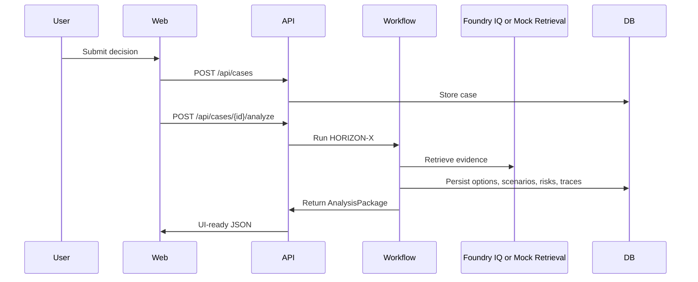

# Architecture

Hxrizxn AI is a code-first monorepo. The MVP runs locally with SQLite and mock grounding, and the production skeleton targets Azure Container Apps, Azure PostgreSQL, Blob Storage, Key Vault, Static Web Apps, Monitor, Microsoft Agent Framework, and Foundry IQ.

## Runtime Components

- `apps/web`: Next.js 16 App Router frontend with React Flow and ECharts.
- `apps/api`: FastAPI service with Pydantic v2 contracts, SQLAlchemy models, Alembic, and HORIZON-X orchestration.
- `app/services/agent_framework_adapter.py`: Microsoft Agent Framework availability and replacement seam.
- `app/providers/knowledge.py`: `MockKnowledgeProvider` and `FoundryIQKnowledgeProvider`.
- `app/providers/model.py`: Azure Foundry first, direct OpenAI optional, mock fallback.
- `app/providers/storage.py`: local upload storage with an Azure Blob replacement seam.

## Data Flow

## Persistence

The schema implements all requested entities: users, decision cases, options, scenarios, impacts, risks, experiment plans, agent runs, documents, and final recommendations.
