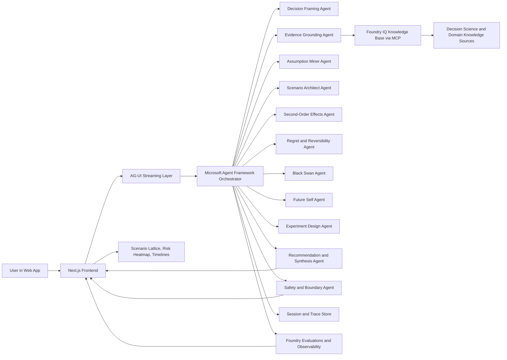
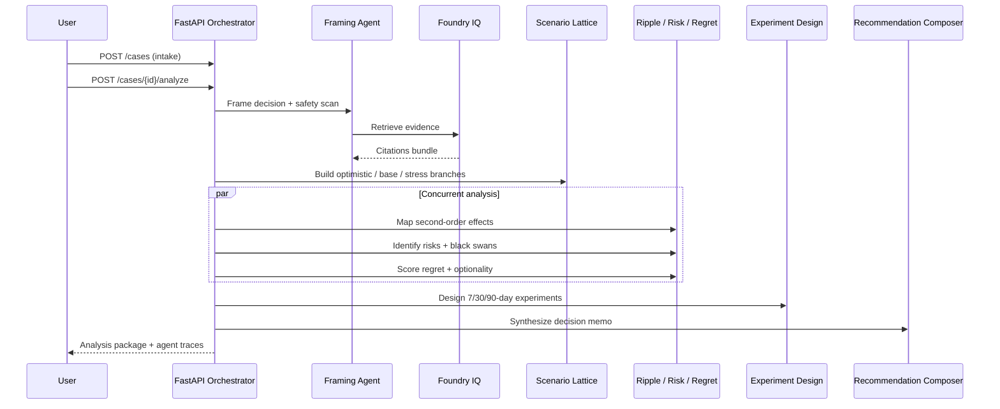

# Hxrizxn AI — Architecture

## System overview

Hxrizxn AI follows a **magentic manager** pattern: specialized agents own one kind of thinking, hand off structured artifacts, and stream observable traces to the UI.

## Workflow phases

### Phase 1 — Sequential framing

1. **Decision Framing** — Parse raw dilemma into goals, fears, constraints, candidate options.
2. **Evidence Grounding** — Query Foundry IQ (or demo KB) for decision-science frameworks and domain facts.
3. **Assumption Mining** — Surface hidden premises and confidence gaps.

### Phase 2 — Concurrent scenario analysis

4. **Scenario Architect** — Generate optimistic, base, and stress futures per option.
5. **Second-Order Effects** — Ripple map across finances, career, relationships, mobility, identity.
6. **Risk + Black Swan** — Common, hidden, and tail-risk identification.
7. **Regret + Reversibility** — One-way vs two-way door scoring, optionality index.

### Phase 3 — Synthesis

8. **Future Self** — Narrative cards grounded in scenario facts.
9. **Experiment Design** — Lowest-cost reversible tests before commitment.
10. **Recommendation Composer** — Proceed / experiment / delay / do-not-proceed verdict.
11. **Safety & Boundary** — Policy enforcement on every stage.

## Memory layers

| Layer | Scope | Contents |
|---|---|---|
| Session memory | Active thread | Raw intake, UI state |
| Case memory | Per decision | Brief, assumptions, evidence, scenarios |
| Narrative memory | UX continuity | Future-self cards, explanations |
| Audit memory | Observability | Agent traces, scores, eval metadata |

## Data model (MVP)

Core entities persisted in SQLite (local) or Postgres (Docker):

- `DecisionCase` — intake and structured context
- `DecisionOptionDB` — candidate paths
- `ScenarioDB` + `ScenarioImpactDB` + `ScenarioRiskDB` — lattice nodes
- `ExperimentPlanDB` — ranked de-risking actions
- `FinalRecommendationDB` — verdict and rationale
- `AgentRunDB` — per-agent input/output traces
- `DocumentDB` — optional uploaded context (sanitized)

## X-TRACE scoring dimensions

Final decision packets expose six signature scores:

| Score | Meaning |
|---|---|
| Alignment | Fit with stated values and goals |
| Evidence confidence | Grounding strength from IQ retrieval |
| Tail-risk resilience | Robustness under black-swan stress |
| Reversibility | How easily the decision can be undone |
| Regret exposure | Anticipated future-self difficulty |
| Experimentability | How much uncertainty a cheap test can collapse |

## Deployment topology

| Environment | Database | Model | IQ |
|---|---|---|---|
| Local dev | SQLite | OpenAI / Azure OpenAI fallback | Demo KB |
| Docker Compose | Postgres + pgvector | Azure OpenAI | Foundry IQ (when configured) |
| Foundry Agent Service | Managed Postgres | Azure deployment | Foundry IQ MCP |

## Frontend screens (planned)

1. **Decision Intake** — dilemma, options, values, irreversibility slider
2. **Decision Brief** — structured summary + human-in-the-loop confirm
3. **Scenario Lattice** — React Flow graph (center canvas)
4. **Risk & Ripple Console** — heatmap + causal chain
5. **Future Self & Experiment Plan** — narratives + ranked next steps
6. **Agent Trace Drawer** — live reasoning log for demo mode

## Reliability patterns

- **Deterministic demo mode** — seeded knowledge and template fallbacks when credentials are absent
- **Agent run persistence** — every stage logged to `AgentRunDB` for replay
- **Verifier agent** — output sanity checks before final synthesis
- **Golden eval cases** — `evals/golden_cases.json` regression harness via `scripts/run_evals.py`
- **Safety gates** — domain boundary detection in framing and final composition
