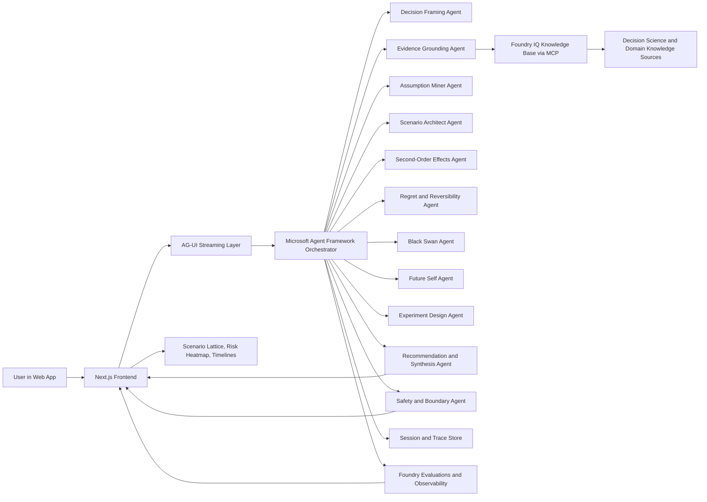

# Hxrizxn AI Deep Research Report

## Executive Summary

Hxrizxn AI should be positioned not as an “AI advisor,” but as a **transparent decision-simulation system for high-stakes, low-frequency, partially irreversible life choices**. That positioning is important because the Microsoft Agents League Reasoning Agents track explicitly rewards multi-step thinking, reliability, and real-world utility, and the official contest rules require a working project, a **public GitHub repo**, an **architecture diagram**, and a **demo video capped at five minutes**. All submissions must also integrate at least one Microsoft IQ layer, while the judging rubric weights **Accuracy & Relevance**, **Reasoning & Multi-step Thinking**, and **Reliability & Safety** at 20% each, with **Creativity & Originality** and **User Experience & Presentation** at 15% each. The rules also create an unusually strong incentive to make IQ integration visible, because there is a separate **Best use of IQ tools** prize in addition to Best Reasoning Agent and Best Overall Agent. citeturn1view2turn2view1turn27view0turn27view2

The core market finding is that **products similar to Hxrizxn AI do exist in fragments, but not yet in a mature integrated form**. In the reviewed sample, emerging consumer tools such as **LifeLens**, **Decision Sandbox**, **newl**, **Decisio**, **FuturaEngine**, and **Shouldi.io** already market AI-driven life-decision simulation, scenario comparison, or structured decision guidance. However, their public positioning generally centers on “simulate your future,” “confidence scores,” “verdicts,” or “action plans,” rather than on an explicit multi-agent reasoning stack with assumption testing, second-order consequence mapping, reversibility scoring, black-swan stress tests, and experiment-first de-risking. That is the opening Hxrizxn AI can exploit. citeturn34search0turn34search3turn34search5turn34search7turn34search11turn34search14

The most important strategic conclusion is this: **to maximize your odds of winning, Hxrizxn AI should feel like a “decision laboratory” rather than a chatbot**. The prior Microsoft Reasoning Agents winner, **CertPrep**, was highlighted by Microsoft because it had clear separation of reasoning roles, deterministic fallbacks and guardrails, observable workflows, and explainable outputs surfaced directly in the UX. The official Reasoning Agents starter kit likewise emphasizes planner–executor, critic/verifier, role-based specialization, evaluation, monitoring, and responsible AI. Hxrizxn AI should borrow those **architectural virtues**, while differentiating on a far more emotionally compelling and broadly relatable problem space: life-changing personal decisions. citeturn24view0turn24view1turn25view0

My strongest recommendation is to make Hxrizxn AI the **first memorable “multi-agent foresight cockpit” for major decisions**: a system that takes a user dilemma, grounds it in evidence, generates a decision lattice of plausible futures, exposes hidden second-order risks, shows a “future self” perspective, computes reversibility and regret, and ends with a concrete low-risk experiment plan. That approach aligns tightly with the contest rubric and also gives you a credible shot at multiple prizes because it showcases Microsoft Foundry, Foundry IQ, explicit agent orchestration, transparent reasoning, and polished presentation in one coherent story. citeturn2view1turn15view1turn15view4turn24view0

## Competitive Landscape

The short answer to your primary research question is **yes, the market is moving toward Hxrizxn AI’s territory, but it is still fragmented**. What exists today is a patchwork of life simulators, coaching systems, decision-intelligence platforms, scenario-planning suites, forecasting communities, digital-twin experiments, and multi-agent frameworks. What does **not** yet appear mature in the reviewed set is a single product that combines these ingredients into a transparent, grounded, emotionally resonant **personal decision operating system**. citeturn34search0turn34search3turn34search5turn10view4turn29view3turn29view0turn10view7turn14view1turn15view2

**Life simulation systems.** The consumer market now contains direct or near-direct plays on “simulate your future,” including LifeLens, Decision Sandbox, newl, Decisio, FuturaEngine, and Shouldi.io. Their messaging already validates demand for structured life-decision help across career, moving, business, housing, and personal tradeoff scenarios. The gap is that these products, at least from their public-facing descriptions, emphasize summarized outputs and lightweight simulation language more than rigorous evidence chains, explicit uncertainty treatment, or transparent agent collaboration. Hxrizxn AI can differentiate by making the reasoning process inspectable rather than magical. citeturn34search0turn34search3turn34search5turn34search7turn34search11turn34search14

**Decision intelligence platforms.** Enterprise products such as Aera, Cloverpop, SAS Intelligent Decisioning, and DECIRA focus on turning data, rules, and business context into better operational or strategic decisions. Aera markets “Agentic Decision Intelligence,” Cloverpop positions itself as the decision layer where AI creates value, and SAS emphasizes automating thousands of operational decisions at scale. The gap is that these offerings are primarily enterprise-facing, process-heavy, and business-outcome oriented. Hxrizxn AI can import their strengths—structure, traceability, learning loops—into a much more human and personal decision context. citeturn10view5turn29view3turn29view2turn11search9

**AI coaching systems.** BetterUp Grow shows that coaching ecosystems are already becoming AI-native and behavior-science informed; BetterUp claims measurable behavior-change gains and deep workplace integration. At the same time, emerging “future self” apps frame AI as an identity or motivation coach rather than a rigorous decision simulator. The gap is that coaching platforms are optimized for habits, reflection, and ongoing development, not for branching analyses of one-way-door decisions. Hxrizxn AI should therefore lean less on “daily coaching” and more on **decision episodes** with visible tradeoff analysis. citeturn10view4turn4search1turn9search5turn9search12

**Scenario planning software.** Anaplan, Palantir Scenarios, Planisware, and Futures Platform all prove that scenario analysis and “what-if” comparison are valuable and commercially important. Palantir’s Scenarios feature literally supports forked branches of reality for what-if analysis; Futures Platform focuses on horizon scanning, multiple future scenarios, and turning signals into decision-ready outputs. The gap is that these are organizational planning tools, not intimacy-scale systems for personal crossroads. Hxrizxn AI can borrow their language of branching futures and scenario comparison, but humanize it. citeturn29view0turn29view1turn10view6turn13search5

**Future forecasting tools.** Metaculus demonstrates a strong market for structured forecasting and probabilistic reasoning, especially where the future is uncertain and multiple outcomes matter. But forecasting platforms are optimized for probabilities over external events, not deeply personal decisions that involve values, emotions, and irreducible ambiguity. Hxrizxn AI’s opportunity is to treat forecasts as one input into a richer decision process, not as the whole experience. citeturn10view7

**Multi-agent reasoning systems.** Microsoft Agent Framework, Microsoft Foundry Agent Service, AutoGen, LangGraph, CrewAI, OpenAI’s Agents SDK, and Google’s ADK all show that agent orchestration is rapidly maturing as infrastructure. Microsoft’s current stack is especially relevant: Agent Framework supports explicit workflows and built-in orchestration patterns such as sequential, concurrent, handoff, group chat, and magentic coordination; Foundry Agent Service is the managed deployment layer; AG-UI adds streaming, state sync, approvals, and generative UI. The gap is that these are mostly developer frameworks, not end-user products. Hxrizxn AI can win by turning that infrastructure into a product judges can immediately feel. citeturn15view1turn15view2turn32view0turn32view2turn8search0turn8search1turn8search2turn8search3

**AI decision support products.** Verticalized decision-support products are proliferating, especially in finance. SoFi Coach, for example, offers personalized budgeting and planning support. Housing-specific AI tools also increasingly offer rent-versus-buy verdicts and scenario comparisons. The gap is that these tools are narrow by domain. Hxrizxn AI should remain **domain-flexible** while still feeling rigorous enough to compete with vertical tools on the decisions that matter most. citeturn11search3turn11news49turn34search8turn34search12turn34search15

**Digital twin technology.** In industry, Siemens and NVIDIA position digital twins as simulation environments that reduce cost, risk, and prototypes before real-world commitment. In healthcare and UX research, digital twins are increasingly discussed as personalized representations that can support decision-making or predict likely responses. That is conceptually adjacent to Hxrizxn AI. The gap is that digital-twin language can imply unrealistic precision or ethically fraught “cognitive cloning.” Hxrizxn AI should therefore use the metaphor carefully: not “we predict you,” but “we simulate plausible futures based on your assumptions and evidence.” citeturn12search0turn12search1turn14view1turn14view2

**Human decision science.** Adrian Camilleri’s work is especially useful for product framing because it shows big life decisions are common, structured, and researchable rather than idiosyncratic chaos. His studies built a taxonomy of 9 decision categories and 58 decision types, and found decisions like **getting married, having a child, and buying a home** to be especially common and important. That is strong evidence that Hxrizxn AI’s target problem is not niche. citeturn36view0

**Regret minimization frameworks.** Regret is not a pop-psychology afterthought; it is a serious decision-science concept with decades of theoretical work behind it. Research on AI-generated future selves also shows that a future-self intervention can reduce anxiety and increase future-self continuity, which is highly relevant for long-horizon decision support. The gap in current products is that many mention confidence or prediction, but few make **anticipated regret** and **future-self continuity** core product objects. Hxrizxn AI should. citeturn6search1turn14view0turn17search15

**Second-order thinking frameworks.** Systems-thinking literature consistently emphasizes feedback loops, unintended consequences, and policy resistance. Stanford’s systems-thinking materials explicitly note that systems thinking improves the odds of spotting unintended consequences, while OECD frames systemic thinking as a way to analyze interconnected trends and issues shaping tomorrow’s world. Most consumer decision tools stop at first-order pros and cons. Hxrizxn AI should make “consequences of consequences” one of its signature features. citeturn7search3turn7search18turn7search8turn7search9

**Behavioral economics.** Prospect theory, planning-fallacy research, and affective-forecasting research all point to the same product opportunity: humans are bad at evaluating losses, durations, timelines, and future emotions in a stable way. In practice, that means a decision tool that merely “asks reflective questions” is not enough; it must actively correct the user’s blind spots. Hxrizxn AI should explicitly counter loss aversion, inside-view planning errors, and overestimated emotional impact. citeturn6search0turn18search0turn18search1

**Strategic planning systems.** Futures Platform, Anaplan, Palantir, and Planisware all show that strategy software is evolving from dashboards toward guided tradeoff simulation. The gap is that almost all of that innovation remains organizational. Hxrizxn AI can occupy the white space between enterprise foresight and consumer coaching: not a boardroom suite, not a journaling bot, but a **personal strategic planning system**. citeturn29view1turn10view6turn29view0turn13search5

The competitive conclusion is straightforward: **Hxrizxn AI should not try to out-coach BetterUp, out-forecast Metaculus, or out-ERP Anaplan. It should combine the strongest ideas from all three worlds into a new category**: a transparent, grounded, multi-agent simulator for major personal decisions. That is the market gap. citeturn10view4turn10view7turn10view6turn15view2

## Product Strategy

The exact problem Hxrizxn AI should solve is this: **people make life-changing decisions with too little structure, too much emotion, poor base-rate awareness, and almost no support for testing assumptions before commitment**. Big decisions are rare enough that most people cannot build expertise through repetition, but consequential enough that the cost of being wrong can echo for years. Decision science and behavioral research both support this framing. citeturn36view0turn6search0turn18search0turn18search1

The most defensible primary users are **high-agency individuals at a crossroads**: early-career professionals deciding whether to switch careers, founders deciding whether to leave salaried work, students considering graduate school, people debating relocation or immigration, and households deciding on major financial commitments such as a home purchase. These map directly to the kinds of decisions users already perceive as “big,” and they fit the examples repeatedly surfaced in life-decision research and current market tools. citeturn36view0turn34search5turn34search11turn34search14

What makes Hxrizxn AI unique should be stated in one sentence: **it does not tell users what to do; it shows them how multiple plausible futures unfold, why they unfold that way, where regret hides, and what reversible experiment they should run before committing**. That is meaningfully different from advice bots, calculators, coaching tools, and general-purpose chat interfaces. citeturn14view0turn7search3turn17search4

Why would people use it? Because most existing tools force a false choice between spreadsheets and vibes. People can either use raw calculators that ignore identity and second-order effects, or they can talk to a chatbot that sounds wise but rarely exposes assumptions, evidence, or branch logic. Hxrizxn AI should sit in the middle: emotionally resonant enough to feel personal, but structured enough to earn trust. citeturn34search8turn34search15turn10view4

Why would judges find it impressive? Because it directly optimizes for the published rubric. A transparent multi-agent decision workflow scores well on reasoning; Foundry IQ grounding and evaluation score well on accuracy and safety; a cinematic scenario-comparison UI scores well on UX and originality; and a personal crossroad is much more memorable in a five-minute demo than another enterprise dashboard. Microsoft’s own winner spotlight on CertPrep reinforces that visible role separation, guardrails, observability, and explainability are exactly the patterns the judges reward. citeturn2view1turn24view0turn24view1turn25view0

**Product vision.** Hxrizxn AI helps people see beyond the obvious future by turning uncertain life decisions into transparent simulations, safer experiments, and wiser commitments.

**Mission.** Reduce irreversible regret by giving individuals a disciplined, evidence-grounded way to explore alternate futures before they act.

The strongest value proposition is this: **“Before you step through a one-way door, Hxrizxn AI lets you test the futures on the other side.”** That language ties together reversibility, regret, and scenario simulation in a way that is easy to demo and easy for judges to remember. citeturn17search4turn14view0

Three personas are especially useful for the MVP. The first is **the ambitious professional**: “Should I quit my stable role and start a company?” The second is **the mobility decision-maker**: “Should I move to another country for work or study?” The third is **the capital allocator**: “Should I buy a house, stay flexible, or delay?” Those are common enough to be legible, consequential enough to feel real, and rich enough to showcase reasoning depth. citeturn36view0turn34search8turn34search15

A strong user journey begins with an intake that captures the decision, options, stakes, values, time horizon, constraints, and assumptions. The system then produces a **Decision Brief**, runs the agent workflow, reveals a **Scenario Lattice**, highlights hidden risks and second-order effects, invites the user to interact with one or more “future selves,” and ends with a **Decision Packet** containing recommended next steps, reversibility analysis, experiments, and an uncertainty note. That gives the experience a beginning, middle, and end, which is critical in a short demo and much stronger than open-ended chat. citeturn24view0turn32view2

For MVP scope, the feature set should be deliberately sharp rather than broad. The MVP should include: structured decision intake; three to five future scenarios; second-order consequence map; regret and reversibility scoring; black-swan stress test; future-self narrative card; a ranked experiment plan; citations and evidence panels from Foundry IQ; and a deterministic “demo mode” with seeded data. That is enough to look production-ready while remaining buildable by one developer in a hackathon window. citeturn15view4turn24view1turn19search2

Future features should expand outward rather than downward: Work IQ-powered personal context, longitudinal decision journals, advisor/counselor mode, collaborative family decisions, domain packs for startup, relocation, graduate school, and home buying, and eventually a “decision CRM” that tracks assumptions against outcomes over time. Those are excellent post-hackathon directions, but they should not dilute the MVP. citeturn15view0turn15view3

## Agent Architecture

The architecture should follow the pattern Microsoft has already signaled it likes: **clear specialization, structured handoffs, deterministic fallback paths, human-in-the-loop checkpoints, and observable execution traces**. The official starter kit explicitly recommends planner–executor, critic/verifier, self-reflection, and role-based specialization, and Agent Framework supports sequential, concurrent, handoff, group-chat, and magentic orchestration patterns. citeturn25view0turn32view0turn33view0

The optimal Hxrizxn AI MVP architecture is a **magentic manager workflow** with the following agents:

| Agent | Purpose | Inputs | Outputs | Reasoning style | Tools | Memory |
|---|---|---|---|---|---|---|
| Decision Framing Agent | Convert messy user text into a structured decision brief | Raw dilemma, options, values, constraints | Decision brief, goals, option set, missing info prompts | Clarification, decomposition, schema extraction | Form parser, structured output | Session memory |
| Evidence Grounding Agent | Retrieve relevant facts, frameworks, and trusted guidance | Decision brief, domain tags | Evidence bundle with citations | Query planning, retrieval, source ranking | Foundry IQ knowledge base via MCP | Shared case memory |
| Assumption Miner Agent | Surface hidden assumptions and low-confidence beliefs | Decision brief, evidence bundle | Assumption list, confidence labels, data gaps | Contradiction search, premise testing | KB retrieval, optional web layer if available | Case memory |
| Scenario Architect Agent | Generate plausible future branches | Options, assumptions, time horizon | Best/base/worst and asymmetric-tail scenarios | Counterfactual reasoning, branching simulation | Model reasoning + templates | Scenario memory |
| Second-Order Effects Agent | Map downstream consequences and feedback loops | Scenario branches | Ripple map, delayed effects, opportunity costs | Systems thinking, causal chaining | Graph builder | Scenario memory |
| Regret and Reversibility Agent | Score one-way vs two-way door characteristics | Scenarios, constraints, time/cost thresholds | Reversibility score, regret exposure, optionality score | Minimax-regret style comparison, path dependency analysis | Scoring engine | Decision memory |
| Black Swan Agent | Stress-test scenarios against tail risks and fragility | Scenarios, assumptions | Stress report, failure triggers, early warning indicators | Adversarial reasoning, fragility testing | Scenario mutation library | Risk memory |
| Future Self Agent | Turn abstract outcomes into emotionally legible narratives | Scenarios, values, time horizon | “Future self” reflections per branch | Narrative synthesis grounded in scenario facts | Avatar/text card generator | Narrative memory |
| Experiment Design Agent | Produce low-risk next steps before commitment | Reversibility, risk, constraints | 7-day, 30-day, and 90-day experiments | Option-value maximization, de-risking | Planning templates | Action memory |
| Recommendation Agent | Synthesize final packet | All prior outputs | Proceed / delay / experiment / do-not-proceed verdict with rationale | Weighted synthesis, conflict resolution | Final report composer | Persistent report memory |
| Safety and Boundary Agent | Block unsafe overreach and enforce boundaries | All user and agent outputs | Safety notices, escalations, abstentions | Policy checks, domain boundary enforcement | Content safety, policy layer | Audit memory |

This design creates visible reasoning stages without becoming a chaotic swarm. In practice, the workflow should begin sequentially—framing, grounding, assumption mining—then fan out concurrently into scenario generation, second-order effects, regret/reversibility, and black-swan testing, before handing off to future-self narration and experiment design. A human-in-the-loop confirmation should occur before any externalized recommendation is finalized, and additional approvals should gate any tool that acts on personal information or external systems. citeturn32view0turn33view0turn33view1

Memory should be treated in four layers. **Session memory** stores only the active decision thread. **Case memory** stores the normalized brief, assumptions, evidence bundle, and generated scenarios. **Narrative memory** stores future-self and explanation artifacts for UX continuity. **Audit memory** stores agent traces, scores, warnings, and evaluation metadata for observability and demo replay. This separation keeps the system inspectable and avoids turning the product into an opaque black box. citeturn19search13turn24view0

The most important architectural principle is that **each agent should own one kind of thinking**. That is what makes the system impressive in a hackathon demo. The user should be able to see which agent challenged an assumption, which one found a hidden risk, which one lowered a reversibility score, and which one designed the experiment. Judges do not just want correct-looking outputs; they want a system that *demonstrates* reasoning. citeturn2view1turn24view0

## Reasoning Framework

Hxrizxn AI should ship with a named proprietary methodology. I recommend calling it **X-TRACE**, short for **eXtract, Test, Render, Analyze, Compare, Experiment**.

**eXtract.** The system first isolates the real decision from the surface question. Users often ask “Should I move?” when the actual decision is “Do I optimize for salary, belonging, immigration optionality, or long-term career convexity?” This stage turns vague emotional dilemmas into structured decision objects. Big-life-decision research supports the idea that these decisions have recurring categories, types, and elements rather than infinite uniqueness. citeturn36view0

**Test.** The system then challenges assumptions, using evidence retrieval and bias checks. This is where planning-fallacy protections, inside-vs-outside view prompts, and reference-class thinking belong. Planning-fallacy research shows people systematically underestimate future time and complexity, while behavioral-economics research shows they overweight losses and frame decisions asymmetrically. citeturn18search0turn6search0

**Render.** Rather than produce a single “answer,” Hxrizxn AI renders a **decision lattice**: best case, base case, worst case, and one or two asymmetric-tail branches that capture important low-probability but high-impact outcomes. This is where forecasting logic and scenario planning meet personal deliberation. The UI should make it clear that these are **plausible futures**, not promises. citeturn29view0turn29view1turn10view7

**Analyze.** Next, the system maps second-order and delayed effects: “If you go to grad school, then debt affects location flexibility; if location flexibility shrinks, startup timing changes; if startup timing changes, your partnership or visa options change.” Systems-thinking sources emphasize that interventions have unintended consequences and feedback loops, and this stage operationalizes that insight. citeturn7search3turn7search18turn7search9

**Compare.** This stage computes three signature quantities: **reversibility**, **regret exposure**, and **optionality**. Amazon’s one-way vs two-way door framing is useful here: reversible decisions can be made faster, while irreversible ones deserve more methodical treatment. Regret theory and future-self research make the comparison more human by asking not just “What performs best?” but also “Which future you is hardest to live with?” citeturn17search4turn6search1turn14view0turn17search15

**Experiment.** The final step is what most competitors miss. Instead of forcing a binary commitment, Hxrizxn AI should ask: “What is the **lowest-cost reversible experiment** that collapses the most uncertainty?” That can mean a 30-day freelance pilot before quitting a job, a short relocation trial before emigrating, or a part-time class sprint before committing to grad school. This is where Hxrizxn AI becomes action-oriented without pretending to know the future. citeturn17search4turn24view0

This framework should surface six visible scores in the final packet: **alignment**, **evidence confidence**, **tail-risk resilience**, **reversibility**, **regret exposure**, and **experimentability**. The recommendation classes should be intentionally simple: **Proceed**, **Proceed via experiment**, **Delay and de-risk**, or **Do not proceed yet**. The simplicity should be in the verdict language, not in the reasoning behind it.

The novelty judges are likely to remember will come from how the framework is embodied in the UX. Hxrizxn AI should let the user explore a **Shadow Path** view showing “the future you are most likely to ignore,” a **Regret Postcard** from three years ahead, and a **Ripple Chain** panel that explicitly shows second-order consequences as they propagate across time. Those features make the system feel new, while still remaining grounded in real decision science. citeturn14view0turn7search3turn18search1

## Experience and Technical Architecture

The complete UX should feel like entering a **decision cockpit** rather than opening a chat app.

The first screen is the **Decision Intake** screen. It asks for the decision in plain English, the available options, desired outcomes, non-negotiables, time horizon, current constraints, and “what would make this feel irreversible?” This screen should also include a “confidence in my current thinking” slider so the system can later compare pre- and post-analysis clarity.

The second screen is the **Decision Brief**. Here the user sees the structured summary created by the Decision Framing Agent, including key values, assumptions, unknowns, and any missing critical inputs. This is also the right place for a soft human-in-the-loop checkpoint: “Is this the decision you actually want analyzed?” That both improves quality and visibly demonstrates the system’s discipline. citeturn33view0turn33view1

The third screen is the **Scenario Lattice**. This should be the visual centerpiece. Each option becomes a parent node, with child branches for base case, upside case, downside case, and tail-risk case. Hovering a node reveals timeline events, confidence, required assumptions, and dominant risks. This is where most judges will first feel that Hxrizxn AI is not a generic chatbot.

The fourth screen is the **Risk and Ripple Console**. One panel shows a risk heatmap by category—financial, emotional, career, mobility, relational, regulatory, health, and timing. The other panel shows a causal chain map of second-order consequences. This is where the “I have never seen this before” effect should happen, because most consumer tools stop at shallow pros and cons. citeturn7search3turn7search18

The fifth screen is the **Future Self and Experiment Plan**. The user sees short future-self narratives for the top two branches, then a ranked experiment strategy that tells them what they can test in 7, 30, and 90 days before taking an irreversible leap. The final card contains the recommendation class, the rationale, and an uncertainty note.

A simple wireframe mental model works well:
- **Left column:** decision brief, assumptions, evidence.
- **Center canvas:** scenario lattice and system timeline.
- **Right column:** risk heatmap, reversibility gauge, future-self cards, and experiment plan.
- **Bottom drawer:** agent trace log, citations, and evaluation/debug panel for demo mode.

Technically, the best hackathon architecture is a **Python-first backend with a highly polished web frontend**. On the frontend, I would recommend **Next.js with TypeScript**, **Tailwind CSS + shadcn/ui** for fast polish, **React Flow** for agent and scenario graph visuals, and **Plotly** for heatmaps, timelines, and branch comparison charts. That mix is fast to develop, demo-friendly, visually modern, and flexible enough to feel product-grade.

On the backend, I would recommend **Microsoft Agent Framework** as the core orchestration layer and **Foundry Agent Service** as the managed runtime and deployment-aligned foundation. Microsoft’s own guidance currently positions Foundry Agent Service as the managed platform for building, deploying, and scaling AI agents, while Agent Framework is the more structured choice for multi-agent systems with explicit workflows, long-running state, and human-in-the-loop scenarios. citeturn15view1turn30search4turn30search16turn32view1

For grounding, Hxrizxn AI should use **Foundry IQ** as the required Microsoft IQ layer. Foundry IQ is positioned by Microsoft as a managed permission-aware knowledge layer for enterprise and external data, and the Foundry IQ MCP integration for Foundry Agent Service supports query decomposition, parallel retrieval, hybrid search, semantic reranking, and source-backed synthesis. That means Hxrizxn AI can show judges something stronger than generic RAG: a visible knowledge layer aligned with the contest rules. citeturn15view0turn15view4turn1view2

For communication between agents and UI, **AG-UI is a major opportunity**. Microsoft’s AG-UI integration supports real-time streaming, state management, approvals, custom UI rendering, and bidirectional state synchronization. That is exactly what Hxrizxn AI needs to stream “live thinking” into a polished interface without forcing you to hand-build protocol glue. In other words, AG-UI can be part of the differentiator, not just plumbing. citeturn32view2

For persistence, a hackathon MVP can start with **SQLite or Postgres** for sessions, decision packets, traces, and saved personas. Blob storage can hold exported reports or screenshots. If time is tight, SQLite is enough; if you want extra production polish, Postgres is the better long-term choice.

For evaluation and reliability, use Microsoft Foundry’s built-in evaluation and observability tooling. Microsoft explicitly recommends evaluating agents on quality, safety, and agent-specific behaviors, and the platform supports acceptance thresholds, built-in evaluators, traces, and observability dashboards. That matters because the rubric rewards reliability and safety heavily, and because visible eval discipline helps judges trust the system. citeturn19search2turn19search5turn19search12turn19search13

For safety, Hxrizxn AI should enforce four constraints. It should never present itself as therapy, legal advice, or licensed financial advice. It should explicitly label generated futures as simulations, not predictions. It should refuse or escalate crisis-adjacent content. And it should use grounding and content safety checks before final synthesis. Microsoft’s responsible AI guidance for Foundry emphasizes discovering quality and safety risks, using guardrails, and designing protections at both the model and runtime levels. citeturn19search0turn19search3turn15view4

A submission-ready architecture diagram description could be expressed like this:

This diagram satisfies the contest requirement to show how the solution uses Microsoft tooling, while also clearly conveying data flow, orchestration, grounding, memory, and visualization. citeturn27view2turn15view1turn15view4turn32view2

## Roadmap, Demo, Risk, and Winning Outlook

The MVP should be defined very tightly: **one killer workflow, one unforgettable visualization, one clear Microsoft IQ integration, and one highly reliable demo path**. Resist the temptation to build a broad personal operating system in hackathon time. Build a single flow that feels complete and polished.

A realistic single-developer roadmap looks like this:

| Phase | Deliverables | Effort | Dependencies | Main risks |
|---|---|---:|---|---|
| Research | Decision domain selection, curated knowledge sources, demo persona, scoring dimensions | 4–6 hrs | None | Scope drift |
| Architecture | Agent specs, workflow graph, data schema, UX wireframes, demo storyline | 5–7 hrs | Research | Over-design |
| Backend | Orchestrator skeleton, agent contracts, scoring logic, Foundry IQ connector, persistence | 10–14 hrs | Architecture | Retrieval complexity |
| Frontend | Intake flow, scenario lattice, risk heatmap, future-self cards, exportable decision packet | 10–14 hrs | Architecture | UI polish time sink |
| Agent orchestration | Sequential + concurrent workflow, approvals, fallback mode, agent trace streaming | 6–10 hrs | Backend | Non-determinism |
| Testing | Golden demo cases, regression scripts, output sanity checks, safety rails, evaluations | 5–8 hrs | Backend + frontend | Inconsistent outputs |
| Demo preparation | Script, seeded dataset, screenshots, architecture diagram, README, 5-minute video | 6–8 hrs | Working MVP | Last-minute instability |

If time gets tight, the first feature to cut should be longitudinal memory beyond the current case. The second feature to cut should be multiple domain packs. The third feature to cut should be voice or avatar polish. The features you should **not** cut are the scenario lattice, risk/ripple map, experiment plan, Foundry IQ grounding, and deterministic demo mode.

The best five-minute demo is emotionally immediate and technically disciplined. I would structure it like this:

**Opening hook.** “Most AI tools give advice. Hxrizxn AI lets you test-drive your future before you commit.”

**Scenario.** Use a high-stakes decision with multiple interacting dimensions, such as: *Should I quit my software job, move to another country for graduate school, and delay launching my startup—or stay employed and test the startup on the side first?* This is ideal because it surfaces career, money, mobility, timing, and regret in one story.

**Flow.**  
Show the user entering the decision.  
Show the system reframing it into a formal decision brief.  
Show agents fanning out in real time.  
Reveal the scenario lattice.  
Click into one branch and show the ripple chain of second-order effects.  
Show the reversibility/regret score comparison.  
Show a future-self card for the top two branches.  
Close with the experiment plan: “Do *not* quit yet; run a 45-day startup pilot and informational interviews with grad programs first.”  

**Closing line.** “Hxrizxn AI doesn’t predict your life. It reduces irreversible regret by making your next step smarter.”

That demo flow is strong because it satisfies the official five-minute cap, clearly demonstrates multi-agent reasoning, and is memorable in a way that enterprise process demos often are not. citeturn27view2turn24view0

Your demo dataset should be **synthetic and public-safe**. The contest repo and rules make clear that submissions are public and should not include confidential information. That means your persona, assumptions, documents, and traces should all be mock or synthetic. The prior Reasoning winner also benefited from a mock-data mode that made live demonstrations reliable even without live credentials; Hxrizxn AI should do the same. citeturn1view2turn25view0turn24view1

The biggest product risks are not technical—they are trust risks. The first is **false precision**: users may mistake scenario simulations for forecasts. The second is **hallucinated certainty** from unguided LLM reasoning. The third is **unsafe emotional overreach**, especially when users ask questions bordering on mental health, family breakdown, or financial hardship. The fourth is **privacy risk** if users enter intimate or identifying details. These are manageable if the system explicitly labels uncertainty, grounds claims, stores minimal data, uses synthetic demos, and includes visible boundaries and abstentions. citeturn19search0turn19search3turn15view4

From a contest strategy standpoint, Hxrizxn AI has a particularly attractive upside because it can plausibly compete on **Best Reasoning Agent**, **Best Overall Agent**, and **Best use of IQ tools**, and it could also benefit from accessibility-first design or student eligibility if applicable under the rules. That is unusual leverage for one concept. citeturn27view0

My winning-probability analysis is necessarily an inference, but it is a useful one. If implemented as a generic chat interface with “advice plus scenarios,” I would rate Hxrizxn AI as a **medium-likelihood finalist but not a likely winner**. If implemented as recommended here—with visible agent roles, Foundry IQ grounding, second-order maps, reversibility/regret logic, experiment-first outputs, deterministic demo mode, and polished AG-UI streaming—I would rate it as a **strong contender for Best Reasoning Agent and a credible Best Overall challenger**. That judgment follows directly from the rubric and from the qualities Microsoft spotlighted in the prior Reasoning winner: role separation, guardrails, observability, and explainable outputs. citeturn2view1turn24view0turn24view1

A practical target scorecard would look like this, assuming strong execution: **Accuracy & Relevance: high**, because the problem is real and the workflow is grounded; **Reasoning & Multi-step Thinking: very high**, because the product visibly decomposes decisions across agents; **Creativity & Originality: very high**, because personal future-lattice simulation is emotionally distinctive; **UX & Presentation: high to very high**, if the lattice and ripple views are polished; **Reliability & Safety: high**, if you ship deterministic demos, evaluations, guardrails, and uncertainty labeling. The weak spot, as always, is community vote, which is partly outside the product itself and tied to how compellingly you package the story. citeturn2view1turn19search2turn19search12

**Open questions and limitations.** Some emerging consumer competitors in this space are early-stage products whose public presence is mostly marketing copy, so their internal reasoning depth, retention, and real-world effectiveness are not fully visible from public materials. I also did not verify every competitor hands-on. The highest-confidence competitive findings, therefore, are about **category convergence and white-space opportunity**, not about precise product-by-product feature parity. That limitation does not change the central conclusion: Hxrizxn AI is still differentiated if you build it as a transparent, grounded, multi-agent decision simulator rather than a generic AI advisor.